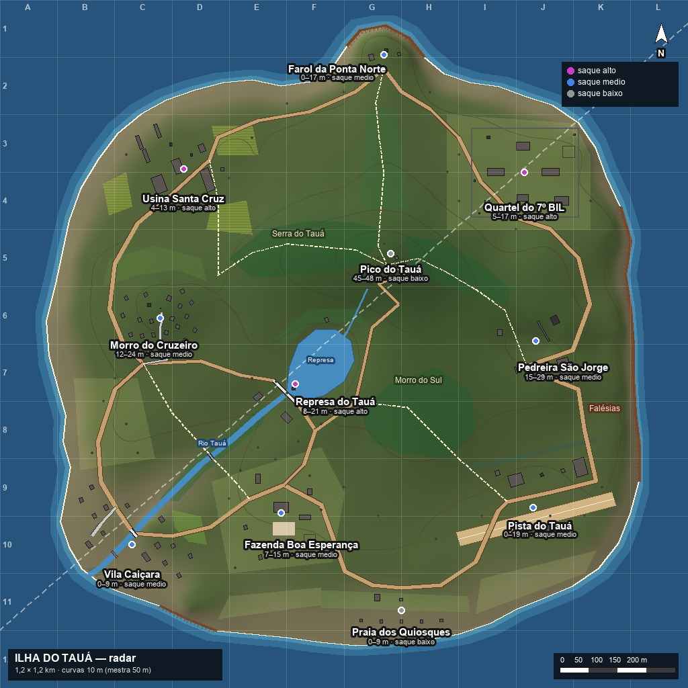

# Ilha do Tauá — Documento de Design de Nível

> Equipe de Design de Níveis · versão 1 + revisão de relevo Planícies 01 · 27/09/2026
> Dados de construção: [`ilha_layout.json`](ilha_layout.json) · Radar: [`ilha_radar.png`](ilha_radar.png) · Validação: [`validacao_ilha.txt`](validacao_ilha.txt)
> Fonte autoral dos dados: `tools/ilha_layout_src.py` → gera o JSON. Radar: `tools/render_ilha.py`. Validador: `tools/validar_ilha.py`.
> Fotos de referência: `reference/` (40 fotos do Wikimedia Commons, ver `reference/SOURCES.md`).

---

## 1. Conceito

**Ilha do Tauá** ("tauá" = barro vermelho, em tupi) é uma ilha fictícia do litoral sudeste brasileiro, entre Paraty e o sul do Espírito Santo.
Ciclo econômico em camadas, legível no próprio terreno: **engenho/usina de cana** (séc. XIX–XX) na planície noroeste, **fazenda de café**
com casarão colonial no sul, **pesca caiçara** na enseada sudoeste, uma **represa** que abastecia a usina, a **pedreira** que forneceu a
brita da barragem, um **quartel** de infantaria leve e uma **pista de terra** abertos nos anos 70. O morro virou comunidade de casas de
alvenaria com laje. A ilha foi evacuada — e é aí que caem 24 jogadores.

**Regras de leitura do mapa (pilares):**

1. **Uma silhueta por POI** — cada lugar tem um marco vertical reconhecível do ar e do chão: chaminé de 40 m (Usina), farol listrado,
   cruzeiro + caixa-d'água (Morro), britador (Pedreira), torre da pista, casa de força/barragem, capela da Vila, casarão, antena do Pico.
2. **Morro baixo no meio, estradas em anel** — o Pico do Tauá chega a 48 m e os morros principais ficam abaixo de 30 m; as planícies permanecem abertas e conectadas por estradas, trilhas e travessias do rio.
3. **Terra aberta é cara** — pastos, pista e campo do quartel são abertos de propósito, mas sempre com cobertura pontual autoral a cada
   25–40 m (cupinzeiros, matacões, carcaças, muros de pedra seca).
4. **Nada procedural** — relevo, mata, prédios e saque são posicionados à mão; o JSON é o contrato para Blender/Godot.

**Números da ilha:** área de terra ≈ 0,90 km² dentro do quadrado de 1,2 × 1,2 km (≈ 37 500 m² por jogador — próximo do Bermuda do
Free Fire para 50 jogadores em 4×4 km, proporcionalmente mais denso, adequado a partidas de 12–15 min).
Ponto mais alto 48,2 m (Pico do Tauá); mediana do terreno em terra 12 m, 75% abaixo de 19 m e 95% abaixo de 30,5 m. 10 POIs + 1 marco, 100 prédios e 257 pontos de saque (10,7 por jogador).

---

## 2. O que aprendemos com os mapas AAA (e como aplicamos)

| Mapa | Lição | Aplicação no Tauá |
|---|---|---|
| **Erangel (PUBG)** | Rio que corta o mapa cria gargalos (pontes) e "decisões de travessia"; campos abertos entre cidades; cidade densa central (Pochinki) como ímã de conflito; bunkers espalhados para ninguém monopolizar [1][2]. | Rio Tauá com **4 travessias** (Ponte da Vila, Passarela, Crista da Barragem, Vau). Morro do Cruzeiro é a "Pochinki" (24 prédios, 70 saques). Saque alto espalhado em 3 pontas (NO, NE, centro). |
| **Verdansk (Warzone)** | Zona em ondas: espera + fechamento, com contagem encolhendo a cada fase; evitar **"zonas mortas"** de fim de jogo sem cobertura (o infame final do Estádio) [3][4]. | 7 fases com espera/fechamento decrescentes; o final é **pré-sorteado entre 14 locais autorais** com cobertura garantida (nenhum final no meio do pasto ou na água). |
| **Kings Canyon (Apex)** | Tiers de saque visíveis por região (cinza/azul/roxo); zonas "quentes" de saque alto; redesenhos posteriores abriram rotas porque os cânions estreitos facilitavam emboscadas [5][6]. | Tier explícito por POI e por prédio (paiol = alto). Radar mostra o tier. Toda área tem **≥ 2 saídas** (vale + trilha/estrada) para evitar corredor-armadilha. |
| **Bermuda (Free Fire)** | Mapa compacto com POIs curtos (Clock Tower, Factory) para lutas rápidas e um **Peak** central alto, ponto de encontro no meio da partida [7][8][9]. | Pico do Tauá central com antena escalável, mas **saque baixo** e cercado de mata (vista forte, recompensa fraca). Represa central de saque alto e pouca construção = drop quente e curto. |
| **Design BR em geral** | Marcos por bioma, pontos altos escaláveis dão informação e tensão; densidade de saque por POI e por contêiner [10][11]. | Cada POI tem tema/bioma próprio (praia, canavial, cava, planalto militar); tabelas de saque por tier/contêiner no JSON. |

Fontes:
[1] [Designing the giant BR maps of PUBG — Game Developer](https://www.gamedeveloper.com/design/designing-the-giant-battle-royale-maps-of-i-playerunknown-s-battlegrounds-i-) ·
[2] [Erangel interactive map — gamermaps.net](https://www.gamermaps.net/map/pubg/erangel) ·
[3] [Battle the Circle Collapse in Warzone — Activision blog](https://blog.activision.com/call-of-duty/2020-05/Battle-the-Circle-Collapse-in-Warzone-Battle-Royale) ·
[4] [Return to Verdansk intel drop — callofduty.com](https://www.callofduty.com/blog/2025/03/call-of-duty-warzone-verdansk-map-return-intel-drop) ·
[5] [Kings Canyon loot spots & hot zones — PCGamesN](https://www.pcgamesn.com/apex-legends/map-kings-canyon-loot-spots-best) ·
[6] [Kings Canyon secrets — G-Loot](https://gloot.com/blog/apex-legends-maps-kings-canyons-secrets-revealed) ·
[7] [Bermuda — Free Fire Wiki (Fandom)](https://garenafreefire.fandom.com/wiki/Bermuda) ·
[8] [Bermuda — Liquipedia Free Fire](https://liquipedia.net/freefire/Bermuda) ·
[9] [Free Fire Bermuda map guide — GamingOnPhone](https://gamingonphone.com/guides/free-fire-bermuda-map/) ·
[10] [Battle Royale Game Design — Game Design Skills](https://gamedesignskills.com/game-design/battle-royale/) ·
[11] [The Playzone (fases do círculo) — PUBG Wiki](https://pubg.wiki.gg/wiki/The_Playzone) · [Dev Letter: Blue Zone Revamp — PUBG](https://www.pubg.com/en/news/10280)

---

## 3. POIs

Coordenadas em metros (origem no centro, X leste, Y norte). "Tamanho" = diâmetro da área jogável do POI. Saque = pontos de spawn no JSON.

| # | POI | Tema | Referência real (fotos em `reference/`) | Centro | Tamanho | Prédios | Saque (tier / pontos) | Altura |
|---|---|---|---|---|---|---|---|---|
| 1 | **Vila Caiçara** | vila de pescadores cortada pelo rio; ranchos de canoa; capela na praia | Trindade (Paraty-RJ), Saco do Mamanguá, vila de Itaúnas-ES | (-370, -350) | 190 m | 16 | médio / 44 | 0–9 m |
| 2 | **Morro do Cruzeiro** | comunidade em encosta: alvenaria sem reboco, lajes, becos e escadaria, cruzeiro no topo | Morro da Providência, Rocinha (RJ) | (-320, 45) | 170 m | 24 (21 casas de 1–3 andares) | médio / 70 | 12–24 m |
| 3 | **Usina Santa Cruz** | usina de açúcar desativada: moenda, chaminé 40 m, armazém, destilaria, vila operária, canaviais | Engenho Central de Piracicaba-SP, Usina Trapiche (PE), ruínas de engenho | (-280, 305) | 190 m | 11 | **alto** / 34 | 4–13 m |
| 4 | **Farol da Ponta Norte** | farol sobre costão, casa do faroleiro | Farol de Santa Marta (SC), Abrolhos (BA), São Thomé (RJ) | (70, 505) | 110 m | 4 | médio / 10 | 0–17 m |
| 5 | **Quartel do 7º BIL** | pátio de formatura, 2 alojamentos, comando, paiol, garagem, heliponto; muro com 3 guaritas | Quartel do Exército em Bela Vista; quartel do Bacacheri (PR) | (315, 300) | 200 m | 11 | **alto** / 26 | 5–17 m |
| 6 | **Pedreira São Jorge** | cava de granito em degraus, britador, correia, paiol de explosivos | Pedreira do Morro Santana (RS), Santo Antônio da Patrulha (RS) | (335, 5) | 160 m | 6 | médio (paiol alto) / 14 | 15–29 m |
| 7 | **Pista do Tauá** | pista de terra de 280 × 25 m, hangar, torre de madeira, tanque de combustível | Aeródromo do Aeroclube de Birigui (SP) | (330, -285) | 300 m | 5 | médio / 14 | 0–19 m |
| 8 | **Represa do Tauá** | barragem de concreto (crista transitável, 62 m), casa de força, tomada d'água | Represa Usina de Atibaia (SP), vertedouro de Santa Maria (DF) | (-85, -70) | 160 m | 5 | **alto** / 12 | 8–21 m |
| 9 | **Fazenda Boa Esperança** | casarão colonial de 2 andares com varanda, capela, tulha, terreiro, curral, casas de colono | Fazenda Jambeiro (SP), Fazenda Ponte Alta (RJ), casarão de Mangaraí (ES) | (-110, -295) | 180 m | 8 | médio / 18 | 7–15 m |
| 10 | **Praia dos Quiosques** | orla com 5 quiosques de sapê, restaurante de 2 andares, posto salva-vidas, coqueiral | Praia de Tambaú (PB), Canoa Quebrada (CE) | (100, -465) | 150 m | 8 | baixo / 13 | 0–9 m |
| M | *Pico do Tauá* (marco) | cume baixo com antena treliçada escalável e casa de rádio | — | (82, 158) | 60 m | 2 | baixo / 4 | 45–48 m |

**Distribuição de saque (257 pontos):** alto 81 · médio 161 · baixo 15 → 10,7 pontos/jogador (meta 10–14).
Pontos internos saem de gabaritos fixos por tipo de prédio (offsets escritos à mão, sem sorteio); pontos externos são posicionados um a um.

**Papéis de cada POI na partida:**
- *Drops quentes (saque alto, disputados):* **Usina** (NO, muitos andares e galpões), **Quartel** (NE, paiol) e **Represa** (centro, pouco
  prédio, luta rápida). Estão em três cantos diferentes → a rota do avião nunca favorece todos ao mesmo tempo.
- *Drop "urbano" de volume:* **Morro do Cruzeiro** — 70 saques médios em 24 prédios, combate vertical de laje em laje (a "Pochinki/Clock Tower").
- *Drops seguros (médio/baixo, periféricos):* Vila Caiçara, Fazenda, Pista, Farol, Praia — equipam o jogador para rotacionar.
- *Marcos sem recompensa:* Pico (visão total, saque baixo) — alto risco, informação, não loot.

Espaçamento: menor distância entre centros de POI = **226 m**; nenhum ponto de terra fica a mais de ~240 m de um final de zona.

---

## 4. Relevo — revisão Planícies 01

- **Pico do Tauá** (82,158): cume de 48 m; a serra central forma lombadas e selas baixas, sem parede montanhosa dominante.
- **Morro do Sul**: até 29 m, separa o corredor da Represa da Pista com mata no dorso.
- **Morro do Cruzeiro**: comunidade em terreno de 12–24 m; becos e lajes dão o jogo vertical em escala de bairro, sem depender de um pico alto.
- **Planícies agrícolas**: Usina 4–13 m, Fazenda 7–15 m e Quartel 5–17 m; os canaviais e pastos ficam em corredores amplos e quase planos.
- **Pedreira**: cava e bordas entre 15–29 m. **Falésias do leste** mantêm cortes de 5–14 m; permanecem como limite costeiro, não como muralha no interior.
- **Perfil medido no height.bin**: mediana 12 m; 75% da terra abaixo de 19 m; 95% abaixo de 30,5 m; máximo 48,2 m.
- **Método**: 180 cotas autorais foram revisadas em `tools/revisar_cotas_planicies.py`; a mesma spline de `tools/ilha_terreno.py` gerou o terreno em `tools/bake_ilha.py`. As posições e cotas são fixas; o bake apenas interpola e aplica água, estradas e plataformas.

## 5. Água

- **Rio Tauá**: cabeceira em cota 32 m → Represa com espelho a 15 m e profundidade máxima de 3 m → vale de 10 m de largura → Vila Caiçara → foz na enseada (-445,-404). O traçado e as cotas de cada trecho são autorais e sempre descem.
- **Represa**: contorno de 10 vértices; barragem de (-122,-64) a (-78,-108), crista transitável a 17 m e face de 6 m.
- **Travessias**: Ponte da Vila (concreto, 16 m), Passarela dos Pescadores (madeira, só a pé), Crista da Barragem (62 m, exposta), Vau do Tauá (pedras, trilha T4). Nadar é possível mas lento e visível.

## 6. Rotas

| Tipo | Largura | Vias |
|---|---|---|
| Estrada de terra (anel) | 6–7 m | E1 Costa Sul · E2 Coqueiros · E3 Pista · E4 Leste · E5 Pedreira→Quartel · E6 Farol · E7 Norte · E8 Usina→Morro · E9 Costa Oeste |
| Estrada de terra (miolo) | 5–6 m | E10 Estrada da Represa (passa **sobre a crista**) · E11 Subida do Pico (serpentina) |
| Calçamento | 4–5 m | V1 Rua da Vila · V2 Escadaria/beco do Morro (costura entre as fileiras de casas) |
| Trilha | 2,5 m | T1 Cumeeira (Usina→Pico) · T2 Farol · T3 Serra Leste (Pico→Pedreira) · T4 Vau (Morro→Fazenda) · T5 Morro do Sul (Pico→Pista) |
| Pista de pouso | 25 m | P1 (200,-340)→(470,-270), 280 m |

Total ≈ 6,6 km de vias; todos os 11 locais conectados por estrada (validado); nenhuma via cruza o rio sem ponte/vau.

## 7. Vegetação (manchas autorais)

| Mancha | Tipo | Função de jogo |
|---|---|---|
| Mata da Serra / Serra Leste | Mata Atlântica densa (15–20 m) | **quebra as linhas de visão do Pico** para baixo; esconde as trilhas T1/T3 |
| Mata do Esporão Norte | mata média | cobre a Trilha do Farol, meio-termo |
| Mata do Morro do Sul | densa | separa Represa × Pista; final de zona "de mata" |
| Mata Ciliar do Tauá | faixa de 20 m no rio | rota furtiva Represa → Vila |
| Mata da Represa Norte | média | cobre a margem norte (final candidato) |
| Capoeira do Cruzeiro | arbustos 2–4 m | esconde agachado atrás do Morro |
| Canaviais Norte/Sul/Oeste | cana 2,5 m (hachurado no radar) | oculta de pé mas **não para bala** — tensão ao redor da Usina |
| Bananal da Vila | folhagem 4 m | visão curta na entrada leste da Vila |
| Manguezal da Foz | raízes/água rasa | lento, desvia da Ponte |
| Coqueiral da Orla / Restinga Sul / Restinga da Pista | troncos finos / arbusto baixo | visão aberta com cobertura esparsa |
| Quebra-vento de eucalipto | fila de troncos a cada 4 m | única cobertura longitudinal ao lado da pista |
| Pasto da Fazenda / Pasto Oeste / Campo do Quartel | **aberto** | zonas de risco, com cobertura pontual (seção 9) |

## 8. Linhas de visão críticas

A redução de altitude alterou as linhas de visão descritas na versão inicial. Os antigos valores de altura de olho e contagens de POIs visíveis foram invalidados; o relevo atual está conferido no radar e no tour. A próxima medição deve amostrar o heightmap revisado junto dos marcos e da vegetação final, incluindo as copas, para registrar quais rotas ficam expostas de cada posição. Até essa rodada, não usar a tabela antiga como regra de balanceamento.

Pontos para essa verificação: antena do Pico (cota do chão 48 m), farol (16 m no centro do POI), crista da barragem (17 m), alto do Cruzeiro (23 m), topo do Morro do Sul (29 m), borda da Pedreira (28 m) e torre da pista. O desenho de combate continua contando com árvores e construções para quebrar a visão no plano baixo.

## 9. Cobertura em campo aberto (42 peças autorais)

Posições exatas em `cobertura_campo_aberto`. Tipos: matacões (2–3 m), **cupinzeiros** (1,2 m — marca do pasto brasileiro), cochos,
muros de pedra seca de 10 m, troncos caídos, fardos de feno, carcaça de fusca, carcaças de teco-teco na pista, tambores, pilha de pneus,
sacos de areia e trincheira ao redor do Quartel, carretas de cana e trator nos canaviais, muretas na crista, barco encalhado na baixada norte.
Espaçamento-alvo: 25–40 m entre peças em pastos; meta de nenhum trecho aberto > 60 m sem cobertura, exceto a pista (intencional) — a conferir no primeiro playtest de travessia.

## 10. Zona (gás) — 12–15 min

| Fase | Raio final | Espera | Fechamento | Dano |
|---|---|---|---|---|
| 0 | 640 m (ilha inteira) | voo 60 s | — | 0 |
| 1 | 400 m | 120 s | 60 s | 1 HP/s |
| 2 | 260 m | 90 s | 50 s | 2 HP/s |
| 3 | 160 m | 75 s | 40 s | 4 HP/s |
| 4 | 90 m | 60 s | 30 s | 6 HP/s |
| 5 | 45 m | 45 s | 25 s | 8 HP/s |
| 6 | 15 m | 30 s | 25 s | 10 HP/s |
| 7 | 0 m | 30 s | 30 s | 15 HP/s |

Duração máxima: **770 s ≈ 12,8 min** (partidas reais terminam antes, entre 10 e 13 min).
**Regra de centro (anti-zona-morta):** no início da partida sorteia-se um dos **14 finais candidatos autorais** (terreiro da Fazenda, beco do
Morro, pátio da Usina, pátio do Quartel, cava da Pedreira, hangar, casa de força, capela da Vila, margem norte da Represa, mata do Morro do
Sul, pé da serra norte, baixada do Farol, pasto oeste com matacões, restaurante da praia). Os centros das fases 1–6 caminham do centro da
ilha até esse final, respeitando |c(i+1) − c(i)| ≤ r(i) − r(i+1) (cada círculo fica dentro do anterior). Nenhum final cai na água, na
falésia ou em pasto sem cobertura.

## 11. Avião

Altitude 300 m, 45 m/s, salto liberado após 3 s, salto forçado no fim. **4 rotas autorais** (sorteio 1 de 4, sentido pode inverter = 8 variações):

| Rota | De → Até | Tempo sobre o mapa | Passa perto de |
|---|---|---|---|
| R1 | (-760,-640) → (760,700) SO→NE | 45 s | Quartel (5 m), Represa (18 m), Vila (40 m), Pico (41 m) |
| R2 | (-800,200) → (800,60) O→L | 36 s | Pico (35 m); Morro e Pedreira a ~100 m |
| R3 | (-60,-800) → (160,800) S→N | 36 s | Pico (10 m), Farol (48 m); Praia, Fazenda e Represa a ~115 m |
| R4 | (-720,700) → (760,-620) NO→SE | 44 s | Usina (1 m), Pista (36 m) |

Nenhuma rota passa sobre os três drops de saque alto ao mesmo tempo (R1 favorece Quartel+Represa; R4 favorece a Usina; R2/R3 nenhum) — distâncias medidas do eixo da rota ao centro do POI.

## 12. Pendências para a construção (avisos do validador)

5 prédios estão em encosta e precisam de **platô cortado ou pilotis** (desnível sob a planta 6,6–9,6 m): depósito do Farol, oficina e
paiol da Pedreira, depósito de carga da Pista, casa do caseiro da Represa (pilotis, como casas de encosta reais). Ver `validacao_ilha.txt`.

## 13. Identidade visual no terreno

O relevo atual usa 180 cotas autorais revistas para manter planícies amplas: pico máximo de 48,3 m, mediana de 12 m, 75% da terra abaixo de 19 m e 95% abaixo de 30,5 m. O radar e as cotas dos POIs foram regenerados a partir desse perfil; os números antigos de visibilidade ainda precisam ser medidos de novo com a vegetação final.

Três placas físicas modeladas em low-poly ajudam a identificar os POIs também ao nível do jogador: **7º BIL / Infantaria Leve** em (318, 205), **Fazenda Boa Esperança / Café · Gado** em (-236, -306) e **Pista do Tauá / Aeródromo de Terra** em (222, -392). Modelos e fonte: `game/assets/models/detalhes/placa_identificacao_*.glb` e `tools/build_poi_signs.py`; posições no contrato `detalhes.json`. As vistas de inspeção `quartel_identificacao`, `fazenda_identificacao` e `pista_identificacao` fazem parte de `res://tests/ilha_tour.tscn`.
